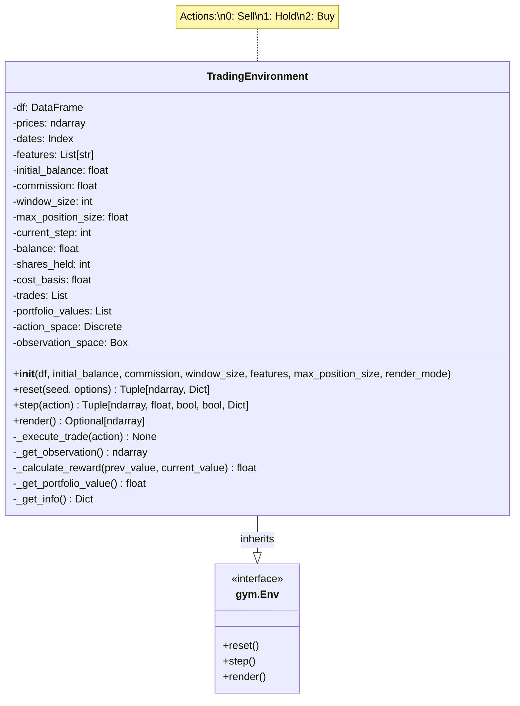
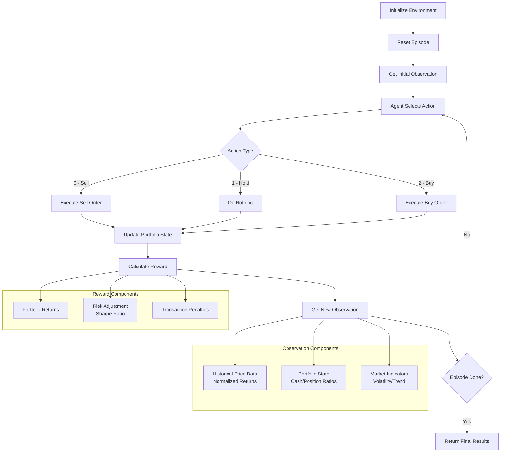

### notes 
https://github.com/yfeng997/MadMario

https://huggingface.co/blog/deep-rl-ppo

https://huggingface.co/learn/deep-rl-course/unit3/deep-q-network

https://huggingface.co/learn/deep-rl-course/unit6/advantage-actor-critic 
## Zadání:
Implementuj libovolne prostredi (Pole, Grid, Hra, vlastni ...etc.) pro Reinforcement \
learning a natrenuj libovolneho agenta (Q-table, DQN, REINFORCE, PPO, DPO ... \
etc.). \

## Forma odevzdání:
Vypracovaný úkol odevzdejte ve formě zdrojového kódu. Projekt ideálně nahrajte na
Github a odevzdejte link do Github repositáře. Link odevzdejte v Google Classroom.

ref: https://classroom.google.com/u/1/c/NzY5MjA5NjY3NjMy/a/NzY5MjA5NjY3Njc5/details

## notes

