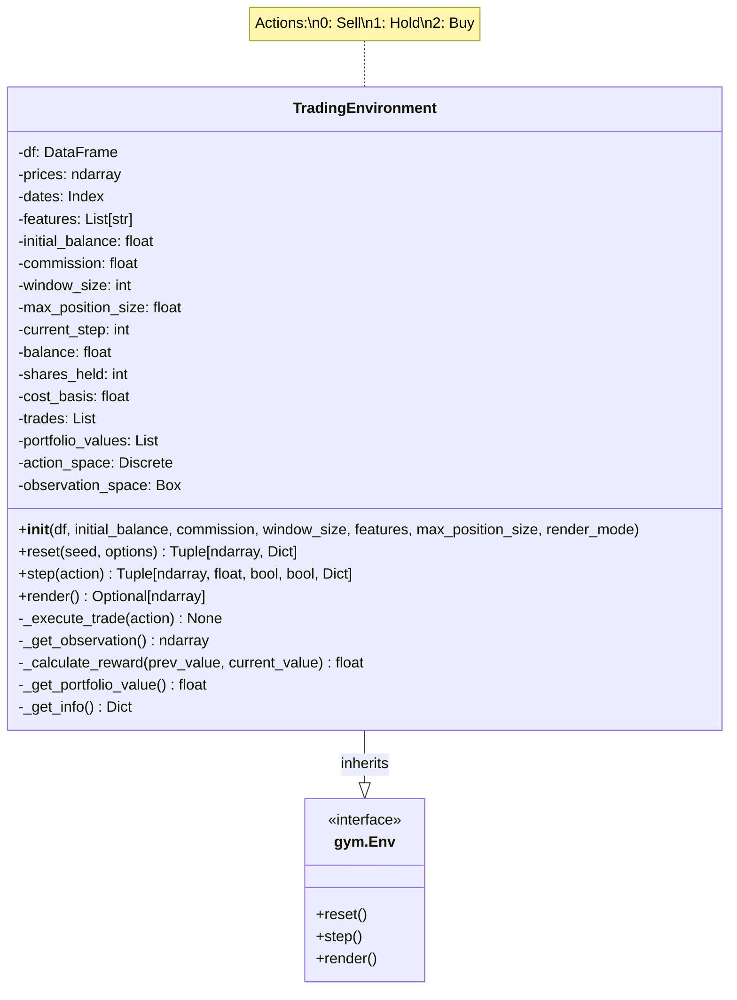
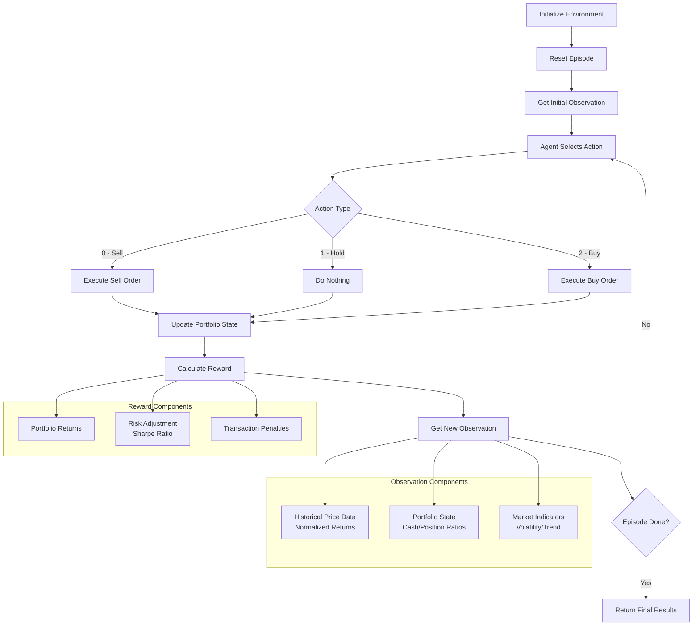

# Mario Bros PPO Agent

A high-performance **Proximal Policy Optimization (PPO)** implementation for training AI agents to play Super Mario Bros using modern reinforcement learning techniques.

## 🎮 Features

- **Advanced PPO Algorithm** with GAE (Generalized Advantage Estimation)
- **Proper Atari Preprocessing** with frame stacking and normalization
- **NOOP Bias System** to encourage active gameplay and reduce idle behavior
- **GPU Acceleration** with PyTorch optimizations
- **Real-time Testing** with multiple speed modes for model evaluation
- **Comprehensive Checkpointing** for model persistence and evaluation

## 🚀 Quick Start

### Prerequisites
```bash
# Install dependencies
uv sync
```

### Training
```bash
# Start training (runs for 1000 iterations)
uv run python train2.py
```

### Testing Trained Models
```bash
# Test with interactive speed selection
uv run python test_mario_model.py
```

## 📊 Training Configuration

| Parameter | Value | Description |
|-----------|-------|-------------|
| Environment | `ALE/MarioBros-v5` | Atari Learning Environment |
| Steps per Iteration | 2048 | Experience collection per update |
| Learning Rate | 2.5e-4 | Conservative for stable training |
| GAE Lambda | 0.95 | Bias-variance trade-off |
| NOOP Bias Factor | 10.0 | Reduces inactive behavior |
| Frame Stack | 4 | Temporal information for motion detection |

## 🏗️ Architecture

- **CNN Policy Network**: 3-layer convolution + fully connected layers
- **Dual Heads**: Policy (action probabilities) + Value function
- **Input**: 4 stacked grayscale frames (84x84 pixels)
- **Output**: 18 possible Mario actions + state value

## 🎯 Key Improvements

1. **Smart Frame Stacking**: Uses `FrameStackObservation` for proper temporal information
2. **Consistent NOOP Biasing**: Applied during both training and inference
3. **Minibatch Training**: 256 samples per batch for stable updates
4. **Proper Normalization**: Observations scaled to [0,1] range
5. **Performance Optimizations**: CPU threading, CUDA optimizations

## 📁 File Structure

- `train2.py` - Main training script with production-quality PPO
- `test_mario_model.py` - Model testing with multiple speed modes
- `pyproject.toml` - Dependencies and project configuration
- `mario_ppo_checkpoint_*.pth` - Saved model checkpoints

## 🎮 Testing Modes

The test script offers multiple playback speeds:

1. **SLOW** (0.05s delay) - Easy to watch and analyze
2. **FAST** (0.01s delay) - Quick playback
3. **ULTRA** (no delay) - Maximum speed
4. **TURBO** (3x skip) - Skip frames for faster evaluation
5. **BENCHMARK** (no rendering) - Pure performance testing

## 📈 Performance Metrics

Training typically shows:
- Episode returns increasing from 0 to 200+ points
- Policy loss stabilizing around 0.01
- Entropy decreasing as policy becomes more deterministic
- Inference speeds of 150-200 FPS on CPU

## 🔧 Troubleshooting

**Import Errors**: Ensure all dependencies are installed with `uv sync`
**No GPU**: Script automatically falls back to CPU with threading optimizations
**Model Not Found**: Check that training has created checkpoint files

## 🎯 Training Tips

- Let training run for at least 100+ iterations for meaningful results
- Monitor episode returns - should increase over time
- Use different checkpoints for testing to see learning progression
- NOOP bias helps prevent the agent from getting stuck doing nothing

The implementation focuses on stability and performance, making it suitable for both research and educational purposes.
### notes 

[1] https://docs.pytorch.org/tutorials/intermediate/mario_rl_tutorial.html

[2] https://github.com/yfeng997/MadMario

[3] https://huggingface.co/blog/deep-rl-ppo

[4] https://huggingface.co/learn/deep-rl-course/unit3/deep-q-network

https://huggingface.co/learn/deep-rl-course/unit6/advantage-actor-critic 
## Zadání:
Implementuj libovolne prostredi (Pole, Grid, Hra, vlastni ...etc.) pro Reinforcement \
learning a natrenuj libovolneho agenta (Q-table, DQN, REINFORCE, PPO, DPO ... \
etc.). \

## Forma odevzdání:
Vypracovaný úkol odevzdejte ve formě zdrojového kódu. Projekt ideálně nahrajte na
Github a odevzdejte link do Github repositáře. Link odevzdejte v Google Classroom.

ref: https://classroom.google.com/u/1/c/NzY5MjA5NjY3NjMy/a/NzY5MjA5NjY3Njc5/details

## notes



